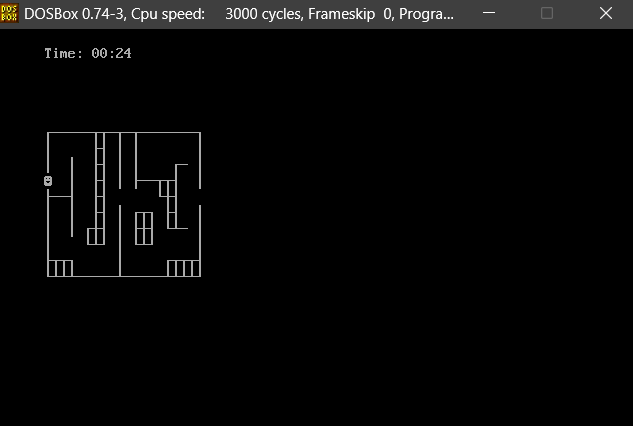
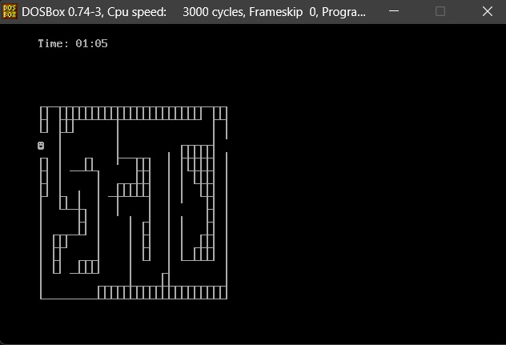
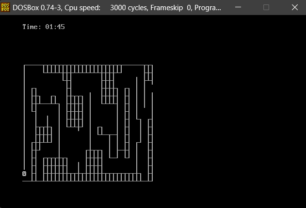

# Maze

## Members

* `All Development` - `Tiago Morais`
* `All Development` - `Tomás Silva`

## Project Description

The project consists of a maze game, where the player must reach the end of the maze before time runs out, if time runs out, the game is over. The game has 3 levels of difficulty, where level 1 is the easiest and level 3 is the hardest.

## How to run

To run the game, just run the .com file (you can use DOSBox for this).

## Slides

- Level 1

- Level 2

- Level 3

## Tools used & Language

* Assembly 16 bits
* DOSBox (to run the .com file)
* EMU8086 (to compile the .asm file & debug the code)